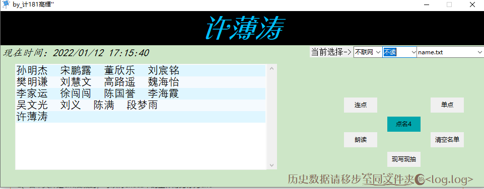
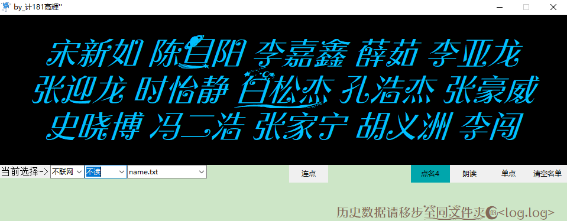

# 一个能说话的点名器

下载最新 [ **点名器** ](https://gitee.com/haoda44/a-talking-roll-call/attach_files/943561/download/%E7%82%B9%E5%90%8D%E5%99%A8_by_%E8%AE%A1181%E9%AB%99%E8%BC%9D%E2%80%98%E2%80%99.7z)

#### 介绍

这是 python 做的一个能朗读的点名器
具有多名单抽取，现写现抽，联网音色，朗读与不朗读切换，能够做到不重复的抽取

#### 软件架构

1.  tkinter
2.  pyttsx3 库
    python 的版本我用的是 3.8.8 win7 能用但是不能说话，具体原因我也不清楚

#### 安装教程

将名单文件以一行一名的形式，保存为 utf-8 后缀为 txt 的文件，将文件放到 name 文件夹下即可使用
程序可以将 name 文件夹下的所有 txt 文件加载到程序中。不需要单独导入

#### 2022_1_12 更新

1. 重写了代码结构和功能逻辑
2. 加入了现写现读功能
3. 解决了部分 bug
4. 加入了朗读开关
5. 在该版本中不需要各种文件绑定了，只需要主程序就可运行，根据软件提示一步一步添加程序所需信息。
6. ** 字体还是需要安装，如果不安装界面会很难看**

### V2.1 / V2.2

#### 104 更新

1、将名单文件复制到本文件夹即可自动在程序中识别名单列表。
2、名单文件是 txt 后缀的，可以将 execl 中的工作簿另存为 txt
3、因为加入了`腾讯语音API`涉及个人 api 账密问题，所以只放出源代码，配置信息不能放

#### 915 更新

1.  按下按钮后即可自动朗读，不需要在另外按朗读按钮了
2.  重绘了界面，更换了字体
    先安装文件夹内的字体然后运行程序，效果就出来了

#### 注意

#### 精简版系统是无法发声的，我刚实验后发现，精简版系统的语音服务均被移除，故程序只能点名，不能朗读！！！望知悉

#### 体验程序的完整功能请用 win10 以上版本 ，使用 win7 只能点名不能朗读，具体原因不知道

#### 界面展示

### V1.0

