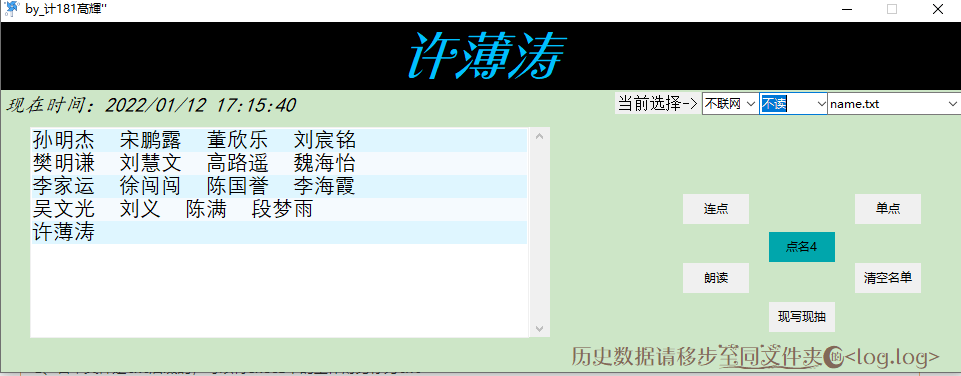
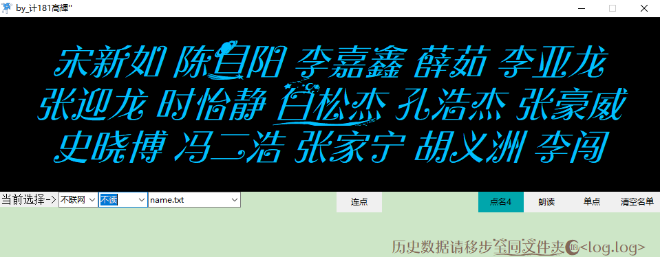

# 一个能说话的点名器

下载最新    [ **点名器** ](https://gitee.com/haoda44/a-talking-roll-call/attach_files/943561/download/%E7%82%B9%E5%90%8D%E5%99%A8_by_%E8%AE%A1181%E9%AB%99%E8%BC%9D%E2%80%98%E2%80%99.7z)
#### 介绍
这是我自学python做的一个能实现朗读的点名器，界面我不是很在行所以就有点丑吧。欢迎大家来给这个小东西添砖加瓦

#### 软件架构
1.  tkinter
2.  pyttsx3库
python的版本我用的是3.8.8 win7能用但是不能说话，具体原因我也不清楚

#### 安装教程
将名单文件以一行一名的形式，保存为utf-8 后缀为txt的文件，将文件放到name文件夹下即可使用
程序可以将name文件夹下的所有txt文件加载到程序中。不需要单独导入

#### 2022_1_12更新
1. 重写了代码结构和功能逻辑
2. 加入了现写现读功能
3. 解决了部分bug
4. 加入了朗读开关
5. 在该版本中不需要各种文件绑定了，只需要主程序就可运行，根据软件提示一步一步添加程序所需信息。
6. ** 字体还是需要安装，如果不安装界面会很难看** 

#### 104更新
1、将名单文件复制到本文件夹即可自动在程序中识别名单列表。
2、名单文件是txt后缀的，可以将execl中的工作簿另存为txt
3、因为加入了腾讯语音涉及个人api账密问题，所以只放出源代码，配置信息不能放

#### 915更新
1.  按下按钮后即可自动朗读，不需要在另外按朗读按钮了
2.  重绘了界面，更换了字体
    先安装文件夹内的字体然后运行程序，效果就出来了

#### 注意

#### 精简版系统是无法发声的，我刚实验后发现，精简版系统的语音服务均被移除，故程序只能点名，不能朗读！！！望知悉
#### 体验程序的完整功能请用win10以上版本 ，使用win7只能点名不能朗读，具体原因不知道

#### 界面展示

